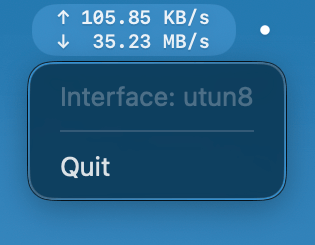

# NetSpeedMonitorSwift

A minimal menu bar network speed monitor for macOS.

A pure Swift rewrite of [NetSpeedMonitor](https://github.com/elegracer/NetSpeedMonitor).

## Requirements

- macOS 26.0 or later
- Apple Silicon (arm64)

## Build & Run

```bash
./build.sh
open build/NetSpeedMonitorSwift.app
```

## Screenshot



## License

MIT
